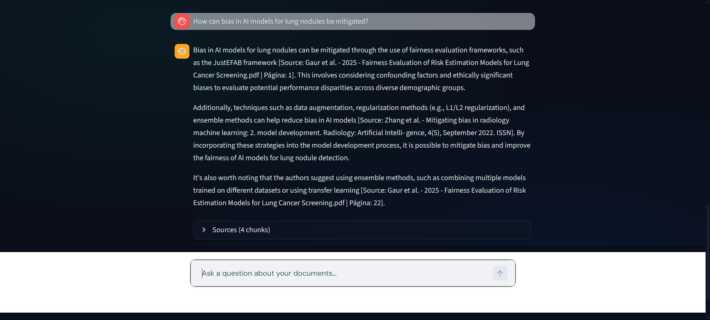
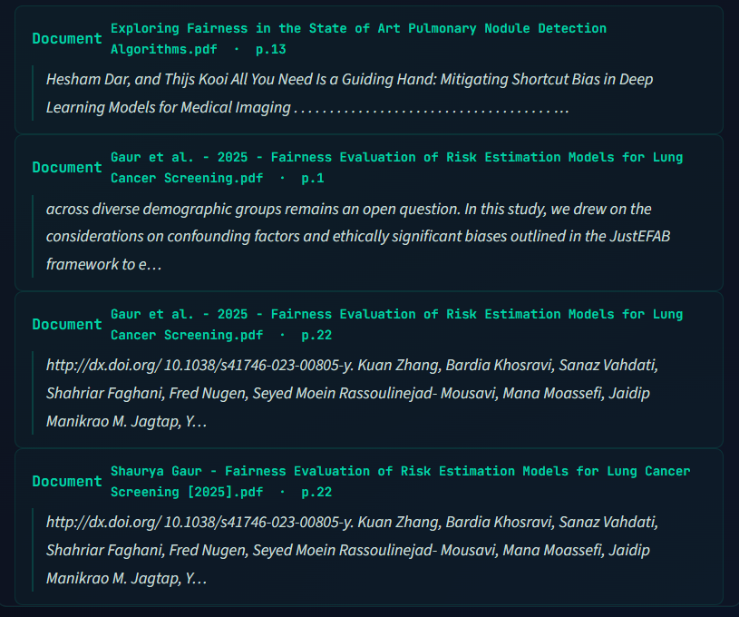

# Edge RAG: Private Bioinformatics Thesis Assistant

A 100% private, edge-optimized RAG system for querying complex medical
literature — designed to run entirely on CPU with under 5GB RAM,
with zero external API calls.

Built to help in a bioinformatics thesis about lung cancer research literature.

---
## Interface 


*The model strictly cites sources and pages inline to mitigate hallucinations.*


*Transparent retrieval: Users can expand the sources to verify the exact document chunks and metadata used by the LLM.*

---

## Benchmarks (AMD Ryzen 7 7730U, 16GB RAM, CPU only)

| Metric | Value |
|--------|-------|
| Backend RAM (FastAPI + Chroma + BGE) | 641 MB peak |
| LLM RAM (Ollama + Llama 3.2 3B Q4) | ~2.5 GB |
| Total system RAM | < 5 GB |
| Inference latency (complex medical query) | ~30.6s avg |
| Citation accuracy | 100% |
| Out-of-domain hallucination rejection | 100% |

---

## Architecture

Linear RAG pipeline orchestrated via Docker Compose:

```
PDF Docs → Ingest → Chunk → Embed → ChromaDB → FastAPI → Streamlit
```

| Component | Technology | Decision |
|-----------|-----------|----------|
| PDF parsing | PyMuPDF | Lightweight C-based, ideal for edge |
| Chunking | LangChain RecursiveCharacterTextSplitter | chunk_size=400, overlap=50 (A/B tested) |
| Vector DB | ChromaDB (persistent) | Disk-based, no server overhead |
| Embeddings | BAAI/bge-small-en-v1.5 (CPU) | Small footprint, strong retrieval |
| LLM | Llama 3.2 3B Q4 via Ollama | Quantized for CPU inference |
| Backend | FastAPI `/query` endpoint | k=5 retrieval |
| Frontend | Streamlit + custom dark mode CSS | Source Cards with citation parsing |

---

## Key Engineering Decisions

**Zero hallucination by design**
`temperature=0.0` + strict prompt. If the vector context lacks the
answer, the model responds: *"I don't have enough information to
answer that."* Out-of-domain rejection validated at 100%.

**Forced citation formatting**
Model outputs sources as `[Source: filename.pdf | Page: X]` —
parsed by the frontend into clickable Source Cards.

**Production Docker hardening**
Static `COPY` in Dockerfile instead of bind-mounts — transforms
the container from dev to production-ready.

**Chunk optimization via A/B testing**
chunk_size=400 and overlap=50 selected after testing multiple
configurations — smaller dense chunks reduce RAM and improve
LLM focus on relevant context.

---

## Stack

Python · FastAPI · Streamlit · LangChain · ChromaDB ·
Ollama · Docker Compose · PyMuPDF · HuggingFace Embeddings

---

## Run locally

**Requirements:** Docker + Ollama installed on host.

```bash

ollama pull llama3.2:3b


git clone https://github.com/GonMelo02/Edge-RAG-GeneralizationFairness_Deep_Learning_Models_Lung_Cancer.git
cd Edge-RAG-GeneralizationFairness_Deep_Learning_Models_Lung_Cancer
cp .env.example .env

# Add your PDFs to /docs, then:
docker compose up --build
```

Frontend available at `http://localhost:8501`

---

## Roadmap/ Possible Future Works

- **Agentic workflows** — LangGraph multi-agent (Researcher + Clinical Reviewer)
- **Advanced parsing** — IBM Docling for semantic table and layout extraction
- **Hybrid search** — BM25 sparse + BGE-M3 dense retrieval with Cross-Encoder reranking
